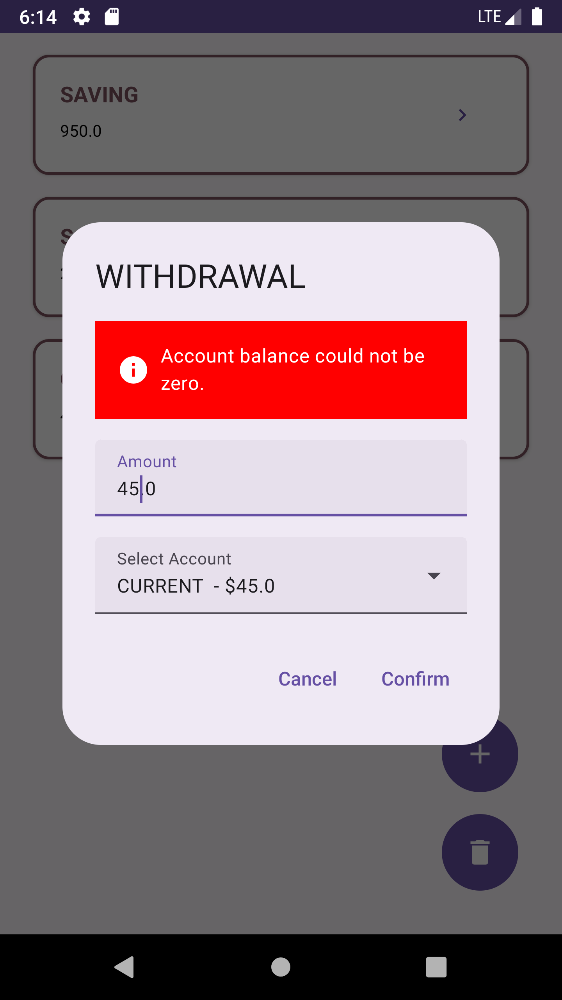

# Banking App

  

## Overview

This Android application is a simple banking app written in Kotlin, allowing users to make deposits and withdrawals. The app follows the Clean Architecture principles and utilizes a small database implemented with Room. The modular design allows for easy replacement of the data layer with API integration if needed.

## Features

1. **Deposits and Withdrawals:**
    - Users can make deposits and withdrawals from their accounts seamlessly.

2. **Clean Architecture:**
    - The app is structured following the Clean Architecture principles, which consists of the main layers:
        - **ui**: All Jetpack Compose composables and reusable components.
        - **Presentation Layer:** Responsible for the user interface and user interactions. Implemented in the `presentation` package.
        - **Domain Layer:** Contains the business logic and use cases of the application. Implemented in the `domain` package.
        - **Data Layer:** Handles data retrieval and storage. Implemented using Room database in the `data` package.

3. **Database Integration:**
    - The app utilizes Room for local data storage, providing a scalable and efficient solution.

4. **API Integration:**
    - The data layer is designed in a way that makes it easy to replace the current database implementation with API integration if needed. The `data` package includes interfaces for data sources that can be easily swapped.


## Android Architecture Components

The Android Architecture Components are used to provide an organizational structure and a set of tools for developing robust and maintainable applications. LiveData and ViewModel are employed to handle UI lifecycle and data management efficiently.


## Known Limitations

1. **Transaction History and Reports:**
    - The features to display transaction history and generate reports are not yet implemented. This could be a potential enhancement for future releases.

2. **User Interface (UI) Improvement:**
    - The current UI is basic and can be improved for a more user-friendly experience. Future iterations of the app could focus on enhancing the user interface and incorporating user feedback.

## Getting Started

To run the app, follow these steps:

1. Clone the repository:

   ```bash
   git clone https://github.com/your-username/banking-app.git
   ```

2. Open the project in Android Studio.

3. Build and run the app on an emulator or a physical device.

## Running Tests

To execute the tests, use the following command:

```bash
./gradlew test
```